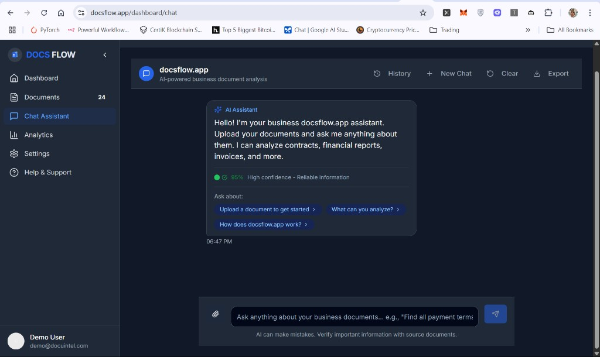
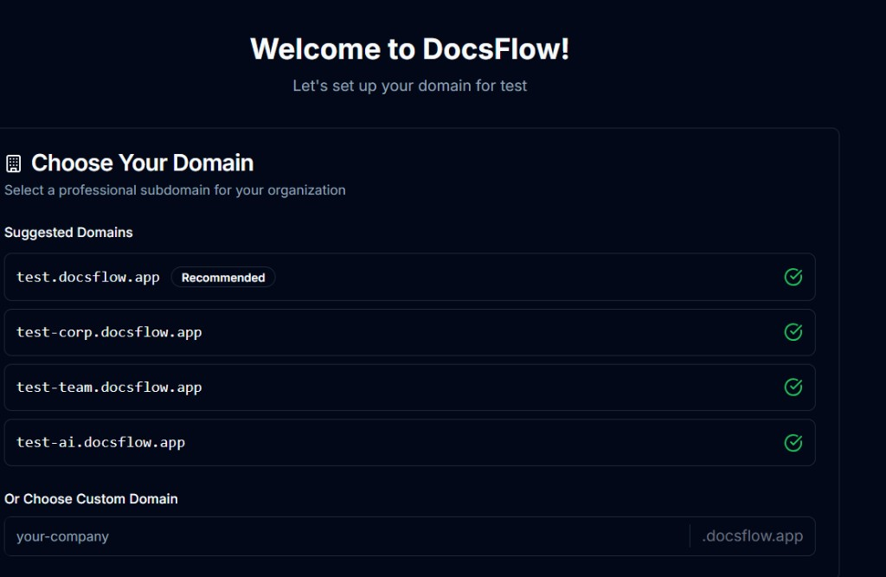
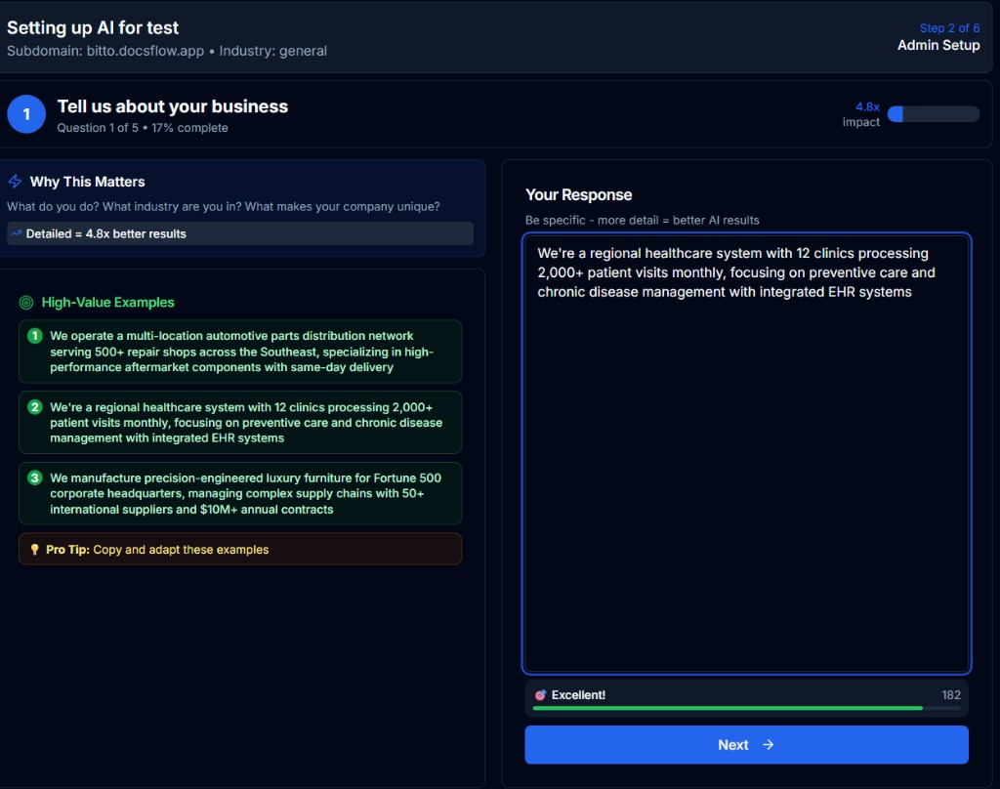
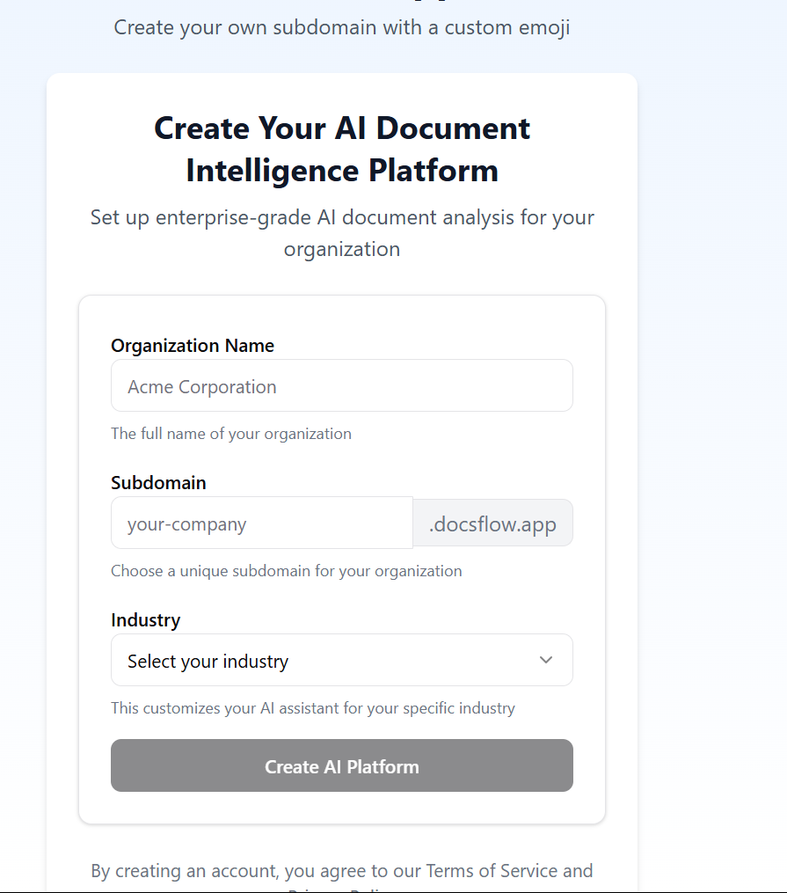

<div align="center">

# DocsFlow

**Your team's private AI workspace for document intelligence**

Each team gets their own subdomain — `sales.docsflow.app`, `legal.docsflow.app` — with role-based access, AI-powered search, and every answer traced back to the source document.

[](https://docsflow.app)
[](LICENSE)
[](https://nextjs.org)
[](https://typescriptlang.org)

<br />



</div>

---

## How It Works

1. **Create your workspace** — Pick a subdomain (`your-team.docsflow.app`) and invite your team
2. **Upload documents** — PDFs, Word, Excel, PowerPoint, images, and text files
3. **Ask questions in plain English** — The AI searches across all your documents and returns answers with exact source citations
4. **Control who sees what** — 5-tier access levels (Public → Executive) plus Admin/User/Viewer roles per workspace

Every answer includes a confidence score and clickable source links. No hallucinated claims — if the AI can't find it in your documents, it says so.

<br />

<div align="center">

| Choose Your Subdomain | AI Chat with Sources |
|:---:|:---:|
|  |  |
| *Pick `sales.docsflow.app` or any custom subdomain* | *95% confidence — answers traced to source documents* |

| AI Persona Setup | Workspace Onboarding |
|:---:|:---:|
|  |  |
| *Guided 6-step setup tailors the AI to your business* | *Industry-specific configuration with custom AI assistant* |

</div>

---

## What Makes This Different

| Feature | What it does |
|---------|-------------|
| **Isolated team workspaces** | Each subdomain is a fully separate environment — database-level row security ensures zero data leakage between teams |
| **Hybrid AI search** | Combines meaning-based search (vector similarity) with keyword matching for higher accuracy than either alone |
| **Multi-model AI failover** | If one AI provider goes down, queries automatically route to the next (Llama 3.3 → GPT-4o-mini → Mixtral → Gemini) |
| **Confidence scoring** | Every response includes a grounded confidence score — low-confidence answers are flagged rather than presented as fact |
| **Custom AI persona** | Each workspace can customize the AI's role, tone, and focus areas for their industry |
| **Source attribution** | Every claim in every answer maps back to a specific document section — click to verify |

---

## Architecture

```
User (sales.docsflow.app)
    │
    ├── Clerk Auth + Edge Middleware (tenant resolution)
    │
    ▼
Next.js 15 API Layer
    │
    ├── /api/chat ──────────── RAG Pipeline
    │                              │
    │                    ┌─────────┴──────────┐
    │                    │                    │
    │              Pinecone              LLM Failover
    │            (hybrid search)      (4-model cascade)
    │           namespace per tenant
    │
    ├── /api/documents ─── Upload → Parse → Chunk → Embed → Index
    │                      (Vercel Blob)  (LangChain)  (OpenAI)  (Pinecone)
    │
    ├── /api/queue ─────── Background processing (Supabase job queue)
    │
    └── /api/stripe ────── Subscription billing + usage tracking
            │
            ▼
    Supabase PostgreSQL (Row-Level Security on all tables)
```

### RAG Pipeline

The retrieval pipeline processes queries through multiple stages:

1. **Query Classification** — Detects intent, complexity, and routes to the appropriate model tier
2. **Conversation Memory** — Loads recent messages and reformulates vague follow-ups into standalone queries
3. **Hybrid Search** — Vector similarity + BM25 keyword matching with Reciprocal Rank Fusion
4. **Hierarchical Retrieval** — For large collections: ranks documents first, then searches within top matches
5. **Confidence Scoring** — Threshold-based abstention — the AI won't guess if context is insufficient
6. **Source Attribution** — Every claim maps to a specific document section with page numbers

### Multi-Tenant Isolation (4 Layers)

| Layer | Mechanism |
|-------|-----------|
| **Database** | Supabase Row-Level Security — queries physically cannot return another tenant's data |
| **Vectors** | Pinecone namespace separation per tenant — cross-tenant search is impossible |
| **Auth** | Clerk session tokens carry tenant context, validated on every request |
| **Routing** | `{tenant}.docsflow.app` resolved in edge middleware before any API call |

---

## Tech Stack

| Layer | Technology |
|-------|-----------|
| **Framework** | Next.js 15 (App Router, Turbopack) |
| **Language** | TypeScript |
| **Auth** | Clerk (SSO, SAML, webhook sync) |
| **Database** | Supabase (PostgreSQL + RLS) |
| **Vector Store** | Pinecone (namespace-per-tenant) |
| **LLM** | Llama 3.3 70B → GPT-4o-mini → Mixtral → Gemini 2.0 Flash (4-tier failover) |
| **Embeddings** | OpenAI text-embedding-3-small (1536d) |
| **Payments** | Stripe (subscription tiers + usage metering) |
| **File Storage** | Vercel Blob |
| **Queue** | Supabase-backed job queue with cron worker |
| **UI** | Tailwind CSS, Radix UI (shadcn/ui), Framer Motion |
| **Deployment** | Vercel (serverless + edge middleware) |

---

## Project Structure

```
docsflow/
├── app/                    # Next.js App Router
│   ├── api/                # API routes (chat, documents, queue, auth, admin, stripe)
│   ├── dashboard/          # Protected dashboard pages
│   └── ...                 # Auth pages, onboarding, landing
├── components/             # React components (chat, admin, documents, UI primitives)
├── lib/                    # Core business logic
│   ├── rag/                # RAG pipeline
│   │   ├── core/           # Embeddings, retrieval, generation, sparse vectors
│   │   ├── storage/        # Pinecone adapter (implements VectorStorage interface)
│   │   └── workflows/      # Query, ingest, delete workflows
│   ├── auth/               # Auth provider factory (Clerk/Supabase)
│   ├── subscription/       # Tier enforcement and billing
│   └── constants.ts        # Centralized domain and URL configuration
├── types/                  # TypeScript types (database relations, global)
├── tests/                  # E2E and integration tests
├── scripts/                # Database migrations and tooling
└── docs/                   # Architecture documentation
```

---

## Key Engineering Decisions

| Decision | Rationale |
|----------|-----------|
| **Pinecone over pgvector** | Namespace isolation maps naturally to multi-tenancy; managed scaling without ops burden |
| **4-model LLM failover** | No single provider dependency — automatic cascade on rate limit or outage |
| **Supabase job queue over Redis** | RLS applies to jobs, single data layer, right-sized for early-stage SaaS |
| **Hybrid search (dense + sparse)** | Keyword matching catches exact terms that embedding similarity misses |
| **skipGeneration in query workflow** | Chat route handles its own LLM call with persona context, so the RAG pipeline skips redundant generation |

---

## Getting Started

```bash
git clone https://github.com/nicuk/docsflow.git
cd docsflow
npm install

cp .env.example .env.local
# Fill in API keys (Clerk, Supabase, Pinecone, OpenRouter, Stripe)

npm run dev
```

Open [http://localhost:3000](http://localhost:3000).

---

## License

MIT — see [LICENSE](LICENSE) for details.

---

<div align="center">

Built by [Nic Chin](mailto:nic.chin@bitto.tech)

</div>
